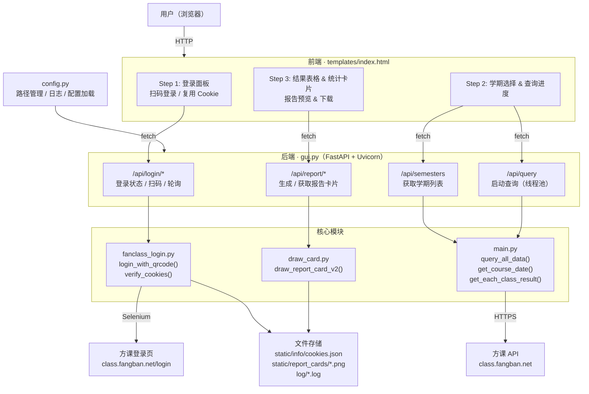

# 研讨厅提问记录查询


<div align="center">


</div>

<div align="center">


</div>


查询研讨厅每节课的提问记录，帮助用户快速了解自己的提问次数、有效率等数据，方便及时与课程记录进行校对。

系统会自动获取指定学期内所有研讨厅课程的提问数据，以表格形式展示每一次提问的状态（有效 / 无效 / 未出结果）、日期、班级、期数、教室和主讲人，并可一键生成统计报告卡片。

## 快速上手

### 直接使用

前往本仓库的 [Releases](https://github.com/ldm0715/fangclass_check_web/releases) 页面，下载最新版本的压缩包，解压后运行 `方课提问记录查询.exe` 即可。

### 从源码构建

```bash
# 1. 克隆仓库
git clone https://github.com/<your-username>/fangclass_Question_History_web.git
cd fangclass_Question_History_web

# 2. 安装依赖（需要 uv）
uv sync --all-groups

# 3. 开发模式运行
uv run python gui.py

# 4. 打包为可执行程序
uv run python build.py
```

打包产物位于 `dist/方课提问记录查询/` 目录。

### 配置

首次运行会自动生成 `config.json`，可修改监听地址和端口：

```json
{
  "host": "127.0.0.1",
  "port": 8000
}
```

## 项目架构

### 整体设计

项目采用 **前后端分离** 的架构，后端使用 FastAPI 提供 REST API，前端为单页面应用（SPA），通过 JS 轮询与后端交互。登录和查询等耗时操作在后端线程中异步执行，前端通过轮询接口获取实时进度。



### 前端

前端代码全部在 `templates/index.html` 中，使用 TailwindCSS 构建 UI，采用三步引导式设计：

| 步骤 | 功能 | 关键 JS 函数 |
|------|------|-------------|
| Step 1 | 登录 — 支持扫码登录和复用已保存的 cookie | `startQrcodeLogin()` / `reuseLogin()` / `pollLogin()` |
| Step 2 | 选择学期并发起查询，显示实时进度条 | `startQuery()` / `pollQuery()` |
| Step 3 | 展示查询结果表格和统计卡片，支持生成报告 | `loadResult()` / `generateReport()` |

### 后端

| 文件 | 职责 | 关键函数 |
|------|------|---------|
| `gui.py` | Web 服务入口，定义所有 API 路由，管理全局状态 `app_state` | 路由: `/api/login/*`, `/api/semesters`, `/api/query`, `/api/report/*` |
| `main.py` | 数据查询核心，调用方课 API 获取提问记录 | `query_all_data()` — 查询主入口；`get_course_date()` — 获取学期日期；`get_class_id()` — 获取课程 ID；`get_each_class_result()` — 获取单节课提问数据；`data_extract()` — 从 API 响应中提取提问记录 |
| `fanclass_login.py` | 登录模块，使用 Selenium 无头浏览器实现微信扫码登录 | `login_with_qrcode()` — 扫码登录主流程；`verify_cookies()` — 验证 cookie 有效性；`save/load/delete_cookies()` — cookie 持久化 |
| `draw_card.py` | 使用 Pillow 绘制统计报告卡片（PNG 图片） | `draw_report_card_v2()` — 动态计算画布大小，绘制表头、数据行、统计概览和页脚 |
| `config.py` | 路径管理、日志配置、配置文件加载 | `setup_logging()` — 配置控制台 + 按天分割的文件日志；`load_config()` — 加载/生成 `config.json` |
| `build.py` | 打包脚本，调用 PyInstaller 构建可执行程序 | `main()` — 执行 PyInstaller 打包 |
| `build.spec` | PyInstaller 打包配置，定义入口、隐藏导入和数据文件 | — |

### 目录结构

```
fangclass_Question_History_web/
├── gui.py                  # Web 服务入口
├── main.py                 # 数据查询核心
├── fanclass_login.py       # 扫码登录模块
├── draw_card.py            # 报告卡片生成
├── config.py               # 配置与路径管理
├── build.py                # 打包脚本
├── build.spec              # PyInstaller 配置
├── config.json             # 运行时配置（自动生成）
├── templates/
│   └── index.html          # 前端页面
├── static/
│   └── info/               # cookie 存储
└── log/                    # 日志文件（按天分割）
```

## 日志系统

项目内置完善的日志系统，**所有控制台输出均会同步记录到日志文件**，包括：

- 应用启动信息与配置加载
- Uvicorn HTTP 请求日志（访问路径、状态码等）
- 登录流程日志（二维码加载、扫码状态、Cookie 验证）
- 数据查询进度与结果
- 错误与异常堆栈

日志文件按日期分割，存放在运行目录下的 `log/` 文件夹中：

```
log/
├── 2026-03-23.log
├── 2026-03-24.log
└── ...
```

- 文件名格式：`YYYY-MM-DD.log`
- 每日零点自动切割新文件
- 自动保留最近 **30 天**的日志，过期文件自动清理

## 鸣谢
[AL0v0/fangclass_Question_History](https://github.com/AL0v0/fangclass_Question_History)

